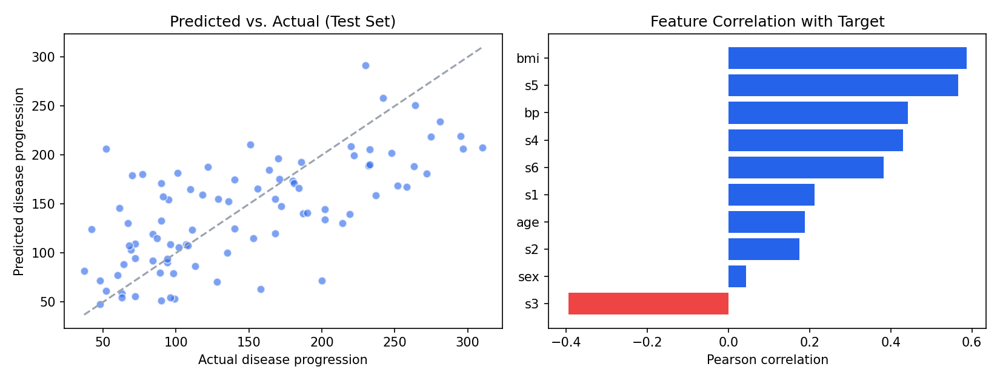

# Statistical Modeling: Predicting Diabetes Disease Progression

Linear regression (OLS) project on scikit-learn's Diabetes dataset (442 patients, 10 baseline features) to identify statistically significant predictors of one-year disease progression and evaluate out-of-sample predictive accuracy.

## Key Results
- **Model fit:** R² = 0.518, Adjusted R² = 0.507, F(10,431) = 46.27, p < 0.001
- **Significant predictors (p < 0.05):** BMI, blood pressure, sex, S5 serum measure
- **Hypothesis test:** Sex has a statistically significant effect on disease progression even after controlling for other clinical markers (p = 0.0001)
- **Test set performance:** RMSE = 53.85 (26.5% better than a naive mean-prediction baseline), MAE = 42.79, Test R² = 0.453
- **Residual diagnostics:** Shapiro-Wilk p = 0.907 → residuals approximately normal, supporting linear model assumptions

## Methodology
1. Exploratory correlation analysis
2. OLS regression with full statistical inference (statsmodels)
3. Hypothesis testing on individual coefficients (α = 0.05)
4. 80/20 train/test split, scikit-learn LinearRegression for predictive metrics
5. Residual normality diagnostics

## Visualization

## Tools
Python, pandas, NumPy, scikit-learn, statsmodels, SciPy, Matplotlib

## Files
- `regression_analysis.py` — full analysis script
- `regression_charts.png` — predicted vs. actual + correlation chart
